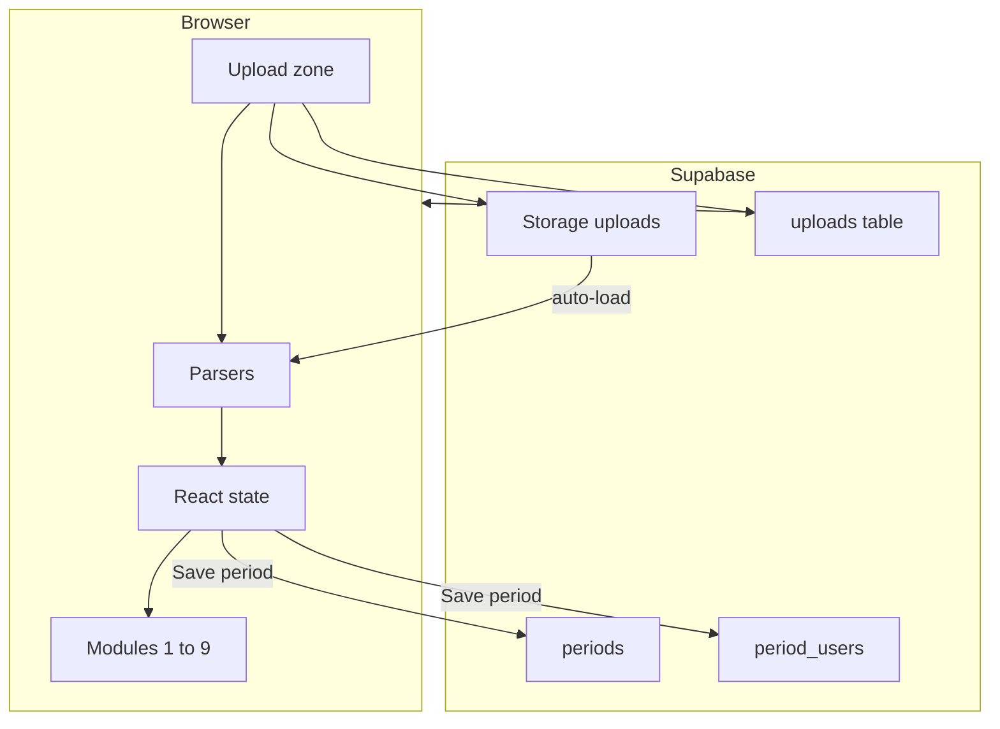

# Supabase persistence layer — Frank Group AI Governance Dashboard

**Purpose:** Handoff document for implementing Phase 2 persistence. The dashboard stays a static site; Supabase holds raw uploads (Storage) and structured data (Postgres). Source of truth for live UI remains [`index.html`](../index.html); keep [`src/dashboard.jsx`](../src/dashboard.jsx) in sync.

**Project:** Frank Group dashboard Supabase  
**Project ref / ID:** `pwuapjdfrdbgcekrwlpr`  
**Project URL:** `https://pwuapjdfrdbgcekrwlpr.supabase.co`

**Security:** Do not commit real API keys. Use [`dashboard-config.example.json`](../dashboard-config.example.json) as a template; create `dashboard-config.json` locally (gitignored).

**Ship / ops:** See [`PHASE2_SHIP_AND_OPERATIONS_CHECKLIST.md`](PHASE2_SHIP_AND_OPERATIONS_CHECKLIST.md) (Supabase checks, Railway variables, verification matrix).

---

## Why Supabase

- Already integrated: `supabaseClient`, `AdminAuthGate`, `handleSavePeriod`, period list/load in `index.html`.
- No new backend: Supabase JS client runs in the browser; Railway keeps serving static files.
- MCP (Cursor): use `apply_migration`, Storage tools, `execute_sql`, etc., against this project.

---

## Completed vs remaining

| Status | Item |
|--------|------|
| Done | Supabase MCP connected to project `pwuapjdfrdbgcekrwlpr` |
| Done | DB schema: `uploads` + RLS (migration `add_uploads_table_and_storage_bucket`); `periods` / `period_users` unchanged from prior SQL |
| Done | Storage bucket `uploads` + authenticated policies (same migration) |
| ✅ Local done | Local `dashboard-config.json` created (gitignored). `railway.toml` fixed to `npm start` so prestart runs. **Railway:** still need to set `SUPABASE_URL` + `SUPABASE_ANON_KEY` in Railway → Variables. |
| Done | Persist each successful ingest to Storage + `uploads` row (signed-in admin) |
| Done | Auto-load latest stored file per `file_type` after sign-in |
| Done | Module 1 upload history UI (list / refresh / load / delete) |
| Done | `docs/supabase-phase2.sql`, `CLAUDE.md`, `index.html`, `src/dashboard.jsx` |

---

## Database schema (apply via migration)

Combine with existing design in [`docs/supabase-phase2.sql`](supabase-phase2.sql). Indexes and RLS on all three tables.

### `periods`

```sql
create table if not exists periods (
  id uuid primary key default gen_random_uuid(),
  label text not null,
  date_from date,
  date_to date,
  created_at timestamptz default now()
);
```

### `period_users`

```sql
create table if not exists period_users (
  id uuid primary key default gen_random_uuid(),
  period_id uuid not null references periods(id) on delete cascade,
  email text not null,
  name text,
  entity text,
  seat_tier text,
  total_spend_usd numeric,
  total_tokens bigint,
  total_requests integer,
  opus_pct numeric,
  fluency_score numeric,
  fluency_tier integer,
  model_breakdown jsonb,
  product_breakdown jsonb,
  created_at timestamptz default now()
);

create index if not exists period_users_period_id_idx on period_users (period_id);
create index if not exists period_users_email_idx on period_users (email);
```

### `uploads` (new — file manifest)

Optional: add `period_id uuid references periods(id) on delete set null` if you want to link files to a saved period later.

```sql
create table if not exists uploads (
  id uuid primary key default gen_random_uuid(),
  file_name text not null,
  file_type text not null,
  storage_path text not null,
  file_size integer,
  uploaded_at timestamptz default now(),
  uploaded_by text
);
```

`file_type` values should align with routing in the app, e.g. `anthropic-csv`, `code-csv`, `conversations`, `projects`, `memories`, `users`.

### RLS (authenticated)

- Enable RLS on `periods`, `period_users`, `uploads`.
- Policies: `select` and `insert` for role `authenticated` (match patterns already documented in `supabase-phase2.sql`).

---

## Storage

- Bucket name: `uploads` (private).
- Object path pattern: `{YYYY-MM-DD}/{sanitized-original-filename}`.
- Policies: authenticated users can upload and read objects in this bucket (adjust if you need stricter rules).

---

## Local credentials

Create **`dashboard-config.json`** at repo root (gitignored):

```json
{
  "SUPABASE_URL": "https://pwuapjdfrdbgcekrwlpr.supabase.co",
  "SUPABASE_ANON_KEY": "<paste anon key from Supabase Dashboard → Project Settings → API>"
}
```

`index.html` already fetches this on load and merges into `runtimeCfg` (see `fetch("/dashboard-config.json")` and `SUPABASE_URL` / `SUPABASE_ANON_KEY` fallbacks near the top of the script).

---

## Application changes (`index.html` — then mirror in `src/dashboard.jsx`)

### 1. Persist after successful parse

In the ingest pipeline (`readFileText` → `processIngestFile` / `runIngestBatch`, ~lines 997–1072):

- After a file parses successfully **and** `supabaseClient` + authenticated session exist:
  - `storage.from('uploads').upload(path, file, { upsert: false or true — decide collision strategy })`
  - `from('uploads').insert({ file_name, file_type, storage_path, file_size, uploaded_by: session user email })`
- Run persistence in the background; UI should not block on it.

### 2. Auto-load on startup

When `supabaseClient` and session are ready:

- Query `uploads` for the latest row per `file_type` (or latest N rows — define rule clearly).
- Download each object from Storage, get text, run through existing parsers (`parseCSV`, `parseConversationsFile`, etc.) and set the same React state as manual upload (`rawRows`, `convItems`, …).

### 3. Upload history UI (Module 1)

- List rows from `uploads` (newest first).
- Actions: “Load this file” (re-download + parse), “Delete” (remove Storage object + DB row — requires delete policies).

---

## Data flow



---

## Files to touch

| File | Change |
|------|--------|
| [`index.html`](../index.html) | Persist ingest, auto-load effect, history UI, optional Storage RLS-related client handling |
| [`src/dashboard.jsx`](../src/dashboard.jsx) | Same script body as `index.html` Babel block |
| [`docs/supabase-phase2.sql`](supabase-phase2.sql) | Add `uploads` table, indexes, RLS; document Storage setup steps in comments |
| [`CLAUDE.md`](../CLAUDE.md) | Phase 2 persistence + project ref |
| `dashboard-config.json` | Create locally only (not in git) |

---

## Future: SharePoint

- Export Postgres / files as needed; replace Storage + DB calls with SharePoint or Excel Online APIs behind the same “parse then state” boundary.

---

## Reference: existing code locations (approximate)

- Supabase URL/key constants and config fetch: top of `index.html` (~147–148, ~2231–2240).
- `createClient` / `supabaseClient`: ~2251.
- `handleSavePeriod`, period inserts: ~2428.
- Period list / selector: ~2280, ~2517+.
- Ingest: `readFileText`, `processIngestFile`, `runIngestBatch`: ~997–1072.

Line numbers drift; search for symbol names when implementing.
